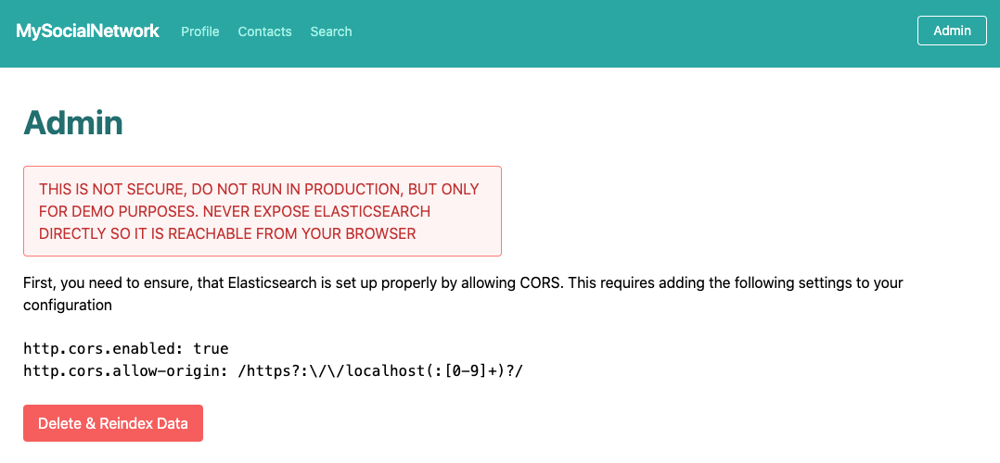
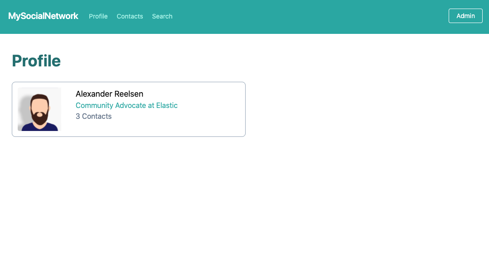
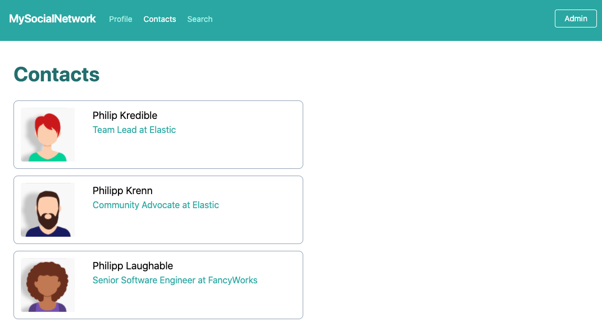
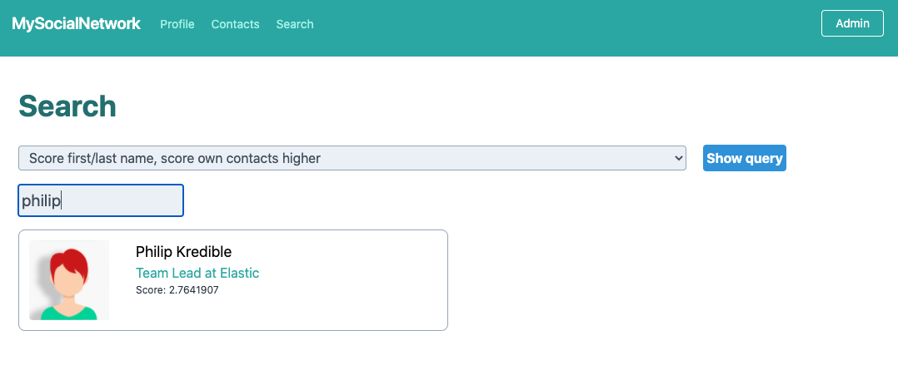

# Svelte sample social network

**NOTE:: DO NOT RUN THIS IN PRODUCTION AS IT IS INSECURE**

This is a quick PoC, that uses Elasticsearch to store very few documents and
demo some different queries to retrieve data.

In order to get up and running run

```bash
npm install
npm run dev
```

You need Elasticsearch up and running as well

```bash
# https://www.elastic.co/downloads/elasticsearch
wget https://artifacts.elastic.co/downloads/elasticsearch/elasticsearch-7.9.3-darwin-x86_64.tar.gz
# wget https://artifacts.elastic.co/downloads/elasticsearch/elasticsearch-7.9.3-linux-x86_64.tar.gz
# wget https://artifacts.elastic.co/downloads/elasticsearch/elasticsearch-7.9.3-windows-x86_64.zip

tar zxf elasticsearch-7.9.3-darwin-x86_64.tar.gz
cd elasticsearch-7.9.3

./bin/elasticsearch
```

You need to change the elasticsearch.yml configuration to support CORS like
this

```
http.cors.enabled: true
http.cors.allow-origin: /https?:\/\/localhost(:[0-9]+)?/
```

Kibana might be helpful for some debugging


```bash
# https://www.elastic.co/downloads/kibana
wget https://artifacts.elastic.co/downloads/kibana/kibana-7.9.3-darwin-x86_64.tar.gz
# wget https://artifacts.elastic.co/downloads/kibana/kibana-7.9.3-linux-x86_64.tar.gz
# wget https://artifacts.elastic.co/downloads/kibana/kibana-7.9.3-windows-x86_64.zip

tar zxf kibana-7.9.3-darwin-x86_64.tar.gz
cd kibana-7.9.3
./bin/kibana
```

# Sample images

You should go the admin part of the application first, in order to create
the data



Then you can check your profile



The list of contacts is shown as well



And the heart of this is the search capability allowing you to specify
different queries


